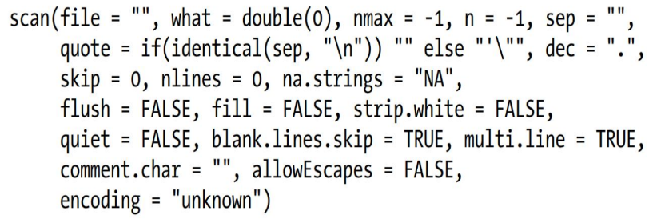

# Data Import/Export
## Data Importing

- Data can be imported from _text files/csv_ files using `read.table()`
  
```R

read.table(filepath, header=FALSE|TRUE, sep="", quote="", skip, row.names=colinfile(or)c(), col.names=c(), na.string=c(), colClasses=c(), stringsAsFactors=TRUE|FALSE, text[empty if filepath is given]))

# quote is a special delimiter for strings containing special characters				# na.strings =c() lists values to be converted as NA
```
- Data can be imported from _xlsx_ files through the xlsx library
```R
library(xlsx)
read.xlsx(filepath, noOfWorksheets, colClasses)
```

- Data can be imported from *spss* through the Hmisc library
```R
library(Hmisc)
spss.get(filepath, use.value.labels=TRUE)
#use.value.labels tells R to use factors for variables with value labels

```

- Reading lines from *stdin* or other files
```R
readLines(con=stdin(), n=-1L, ok=TRUE|FALSE, warn=TRUE|FALSE, encoding="unknown")

#warn to warn for absence of EOL
#ok to warn for lower number of lines present

```

- Reading data using scan
```R
scan(file, what=double(0), nmax=-1, n=-1, sep="", quote, skip, nlines)

#nmax number of lines read at a time 
#n total number of lines

```



## Data Exporting
```R
write.table(x, filepath, append=FALSE|TRUE, quote, sep=" ", eol="\n", na, dec, row.names=TRUE|FALSE, col.names=TRUE|FALSE, qmethod=c("escape", "double"))

#quotes specifies which column to surround with quotes
#dec specifies the decimal separator in numeric columns
#qmethod speifies how to deal with quotes inside quoted characters "escape" uses '\' and "double" transforms " to ""

write.xlsx(var, filepath)
#row names are placed as first column and variable names are used as column names
```

## Database Connectivity
### ODBC Interface
#### RODBC
1. Install and configure ODBC drivers
2. Install RODBC package `install.packages("RODBC")`
3. Import RODBC package `library("RODBC")`
```R
channel <- odbcConnect(dsn, uid, pwd) #Opens channel
df <- sqlFetch(channel, sqltable) #Reads table into dataframe
sqlQuery(channel, query) #Query the database
sqlSave(channel, df, tablename=sqltable,append=TRUE|FALSE) #Writes/updates df to table
sqlDrop(channel, sqltable) #Removes a table from db
close(channel) #Closes connection
```

### DBI Interface
#### RJDBC
[DBI: R Database Interface version 1.1.3 from CRAN (rdrr.io)](https://rdrr.io/cran/DBI/)
- This also has RMySQL, RPostgreSQL, RSQLite, ROracle etc.
- However these may not be accessible in all platforms

```R
con <- dbConnect(dbprovider, dbname=system.file(dbpath, dbname, package))
dbListTables(con)
dbListFields(con, tablename)
var <- dbReadTable(con, tablename)
dbWriteTable(con, tablename, df)
dbRemoveTable(con, tablename)
dbExistsTable(con, tablename) #Returns boolean 
res <- dbGetQuery(con, query)

dbDisconnect(con)
```


### Comparison

| RODBC | DBI |
|-|-|
| Driver availability low on MacOS | Drivers are easily available for all platforms |
| Slower than native driver | Faster than generic driver|
| Package Availability is less | Package availability is higher |
| Lower code quality | Higher code quality through use of S4 Objects | 

# Data Processing

## Pasting multiple data structures

```R
paste(x,y...,sep='', collapse='')
#Return data format -> x1 sep y1 collapse x2 sep y2
```
## Merging Data

```R
merge(x, y, by=c(),by.x,by.y,all=FALSE|TRUE,all.x,all.y,sort=TRUE|FALSE,suffixes,incomparables)
#by.x and by.y overrrides by
#all for outer join all.x and all.y overrides all

#suffixes=c(first, second) indicates the suffix to be given when there are columns with the same names
```
## Transforming Data

```R
df.transformed = transform(df, exp1, exp2....)
#exp are the expressions/transformation to be applies on df
```
## Applying functions

```R
apply(var, margin, fun)
lapply(var, margin, fun) #Returns a list 
sapply(var, margin, fun) #Returns a vector or matrix as per applicability
```
## Binning Data
### Shingle
```R
#Binning of data
shingle(var, intervals=())

equal.count(x, ...) #used to create equal sized bins
```
### Cut
```R
#Converting continous values to discrete ones

cut(x, breaks, labels=NULL, include.lowest=FALSE, right=TRUE< dig.lab=m, ordered_result=FALSE,...)

cut(x, breaks, labels, start.on.monday=TRUE, right=FALSE,)
```
## Combining Groups
```R
library(lattice)
make.groups(x,y,...)
```
## Creating Subsets
```R
#Bracket Notation
df.c <- df[condition]

subset(x, subset, select, drop=FALSE)
```
## Random samples
```R
sample(x, size, replace=FALSE, prob=c())
```
## Aggregation and Summarization
```R
tapply(x, index, fun, simplify=TRUE)
#simply = TRUE returns scalar array else list

aggregate(x, y, fun)
```
## Data Cleaning
```R
duplicated()
unique()
```