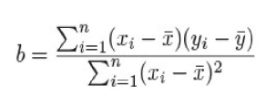

# Linear Models
- Most basic statistical model.
- Analyzes the relationship between a response variable and a set of explanatory variables.
- Predict unknown values

## Assumptions of Regression Line
1. Linearity - The relationship between X and Y is linear
2. Independence of Errors - Error values are statistically independent
3. Normality of Error - Error values are normally distributed for any given value of X
4. Equal variance - The probability distribution of the error has constant variance

> Residuals are the difference between predicted and actual values

## Steps in generating a regression model
1. Gather sample of observed values
2. Create a linear model using `lm()`
3. Find the coefficient from the model using `coefficients(lm)`
4. Extract summary of relationship `summary(lm)` and `residuals(lm)`
5. Use `predict(lm, df)` to predict the values for a new set of predictor variables 
  
## Simple Linear Regression

$y = ax + b$



$a=ybar - b*xbar$

```R
lm(formula, data, subset, weights, na.action, method="qr", model=TRUE, x = FALSE, y = FALSE, qr = TRUE, singular.ok = TRUE, contrasts = NULL, offset, ...) 

#model determines whether to return model frame
#x and y determines whether to return model matrix of response vector should be returned or not
#generates a model using ordinary least squares for the given formula
```

|Symbol|Usage|
|-|-|
|~|Separates response variable from explanatory variable|
|+|Separates predictor variables|
|:|Represents interaction between predictor variables|
| * |Shortcut to represent all possible interactions|
| ^ n| Represents Interaction upto degree n |
|.| Placeholder representing all other variables |
| - | Used to remove a predictor variable from the equation |
|-1| Forces the line through the origin x = 0 |
| I() Identity Function| Element within the parenthesis are interpreted arithmetically |
| function | Mathematical function are also be used directly in formulae | 


## Polynomial Regression
- The relationship is modelled as an $nth$ order polynomial
```R
poly(x, ..., degree=n, coefs=NULL, raw=FALSE)
```
  
## Multiple Linear
- The response variable is predicted from two or more explanatory variables
## Multilevel
- Predicting the response variable from data that have a hierarchical structure
## Multivariate
- Predicting the value of multiple response variables
## Cox Proportional Hazards & Time Series
- Prediction of time
## Resistant Regression

	Done by using least median squares (LMS) or least trimmed squares (LTS) estimators

```R
rlm(formula, data, weights, subset, na.action, method=c("M", "MM", "model.frame"), wt.method=c("inv.var", "case"), model=TRUE, x.ret = TRUE, y.ret = FALSE, contrasts = NULL)
```
  
# Regression Analysis Types

| Type | Definition | 
|-|-|
|Nonlinear | Prediction of the response variable whose values in non linear|
|Nonparametric | The form of the model is derived from the data and not mentioned a priori|
|Robust | The values of response variable in this approach is resistant to the effect of influential observations|

## Summarizing and extracting data from linear model

|Function|Action|
|-|-|
| summary()| Displays details results for the fitted model|
| coefficients() | Lists out the model parameters for the fitted model|
| confint() | Provides confidence intervals for the model parameters|
| fitted() | Lists the predicted values in a fitted model|
| residuals | Lists the residual values in a fitted model |
| anova(lm,...,scale=0,test="F") | Generates an ANOVA table for the fitted model |
| vcov(lm,...) | Lists the covariance matrix for model parameters |
| AIC() | Prints Akaike's Information Criterion |
| plot() | Generates plots for evaluation model fitness |
| predict() | Uses the fitted model to predict the response variables for a new dataset |
| influence() | Describes the influence of various features |
| influence.measures() | Describes the influence in a easier to interpret way |


## Refitting a model
```R
lmnew <- update(lm, formula)
```

## Assumptions of Least Squares Regression
1. Linearity - Relation between response and predictor is linear
2. Full Rank - No relationship exists between predictor variables
	1. If correlation exists between predictor use principal components regression
3. Exogeneity of predictor variables - The expected value of $epsilon=0$ for all predictor variables
	1. Test using ncvTest()
4. Homoscedasticity - The variable of $epsilon$ is constant and not correlation with predictor variables
	1. Use robust or resistant regression function if model is homoscedastic
5. Non autocorrelation - The values of y are not correlated in a sequence of observations
	1. Test using durbin.watson
6. Exogenously generated data - The predictor variables are generated independently of the process that generated $epsilon$
7. The error term $epsilon$ is normally distributed with standard deviation $sigma$ and $mean=0$
	1. If error isn't normal use ridge regression

# Generalized Linear Models
## Logistic Regression
- Prediction of a categorical response from the given explanatory variables
- Predict a binary outcome from a set of numeric variables
```R
glm(formula, data, family=binomial(link="logit"))
```

## Poisson Regression
- Prediction of the response variable from the counts for one or more explanatory variables

## Nonlinear Least Squares

```R
nlm(formula, data, start, control=nls.control(), algorithm=c("default", "plinear", "port"), trace=FALSE,subset,weights,na.action,model=FALSE,lower=-Inf,upper=Inf,...)

#start contains starting estimates for the fit
#control contains list of arguments for controlling the fitting process
#algorithm plinear-golub_pereya, port-nl2sol
#trace whether to print process of training
#lower and upper sets lower and upper bounds for the model resp...
```
